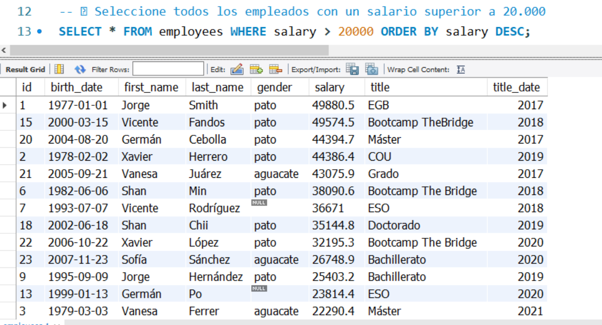
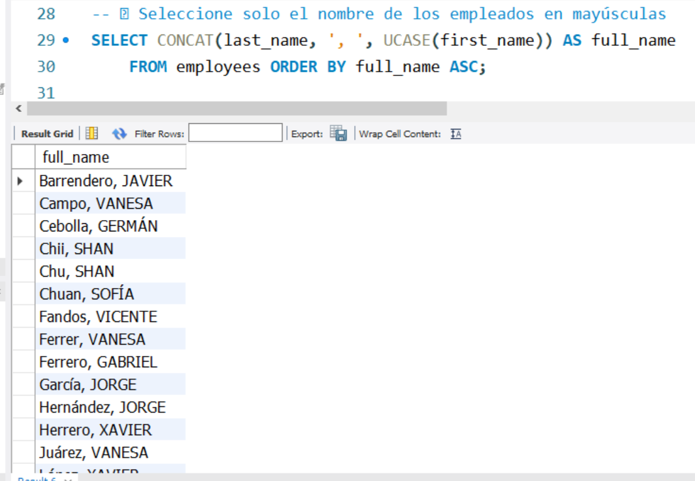
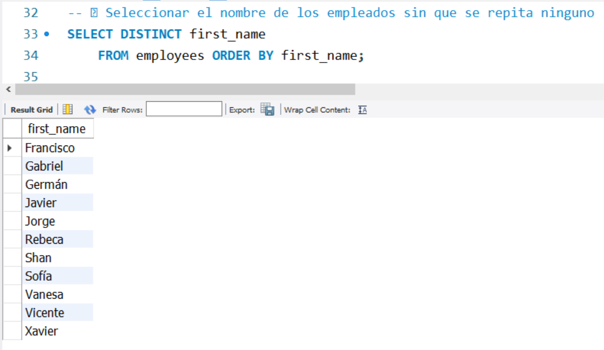
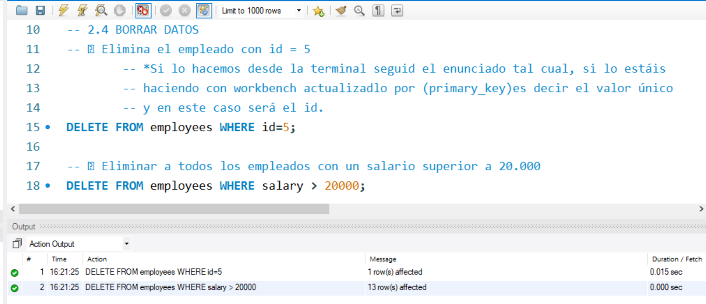

# boot201-mysql

Ejercicio MySQL

[The Bridge - Digital Talent Accelerator](https://thebridge.tech).

### Autor
-- by [xavimat](@xavi-mat)

## PARTE 1: Crear BD, poblar datos, modificar datos.

### 1. Crear Base de Datos

#### 1.1 Crea una base de datos
-- Crea una base de datos que se llame my_company_database.
```sql
CREATE DATABASE my_company_database;
USE my_company_database;
```

#### La base de datos deberá contener la siguiente tabla:
* **employees**. A su vez tendrá los siguientes campos:
    * id
    * birth_date
    * first_name
    * last_name
    * gender
```sql
CREATE TABLE employees (
    id INT AUTO_INCREMENT,
    birth_date DATE NOT NULL,
    first_name VARCHAR(50) NOT NULL,
    last_name VARCHAR(50) NOT NULL,
    gender ENUM('pato', 'aguacate'),
    PRIMARY KEY (id)
);
```

#### 1.2 Añade columnas nuevas a la tabla creada
Añade 3 columnas nuevas a la tabla:
* Columna "salary"
* Columna "title"
* Columna "title_date"
```sql
ALTER TABLE employees
    ADD salary FLOAT DEFAULT 5000,
    ADD title VARCHAR(30) NOT NULL,
    ADD title_date YEAR NOT NULL;
```

### 2. Ejecute las siguientes consultas SQL
#### 2.1 INSERTAR DATOS
Inserte al menos 15 nuevos empleados:
* Al menos 3 empleados deben tener el mismo nombre.
* Los salarios de los empleados deben oscilar en un rango de
    5000 y 50.000 y deben variar entre diferentes géneros.
* Todos los empleados tienen un título.
* Al menos 5 títulos son de 2020.
```sql
INSERT INTO employees
        (birth_date, first_name, last_name, gender, salary, title, title_date)
VALUES  ('1977-01-01', 'Jorge', 'Smith', 'pato', ROUND(RAND()*(45000)+5000, 2), 'EGB', '2017'),
        ('1978-02-02', 'Xavier', 'Herrero', 'pato', ROUND(RAND()*(45000)+5000, 2), 'COU', '2019'),
        ('1979-03-03', 'Vanesa', 'Ferrer', 'aguacate', ROUND(RAND()*(45000)+5000, 2), 'Máster', '2021'),
        ('1980-04-04', 'Gabriel', 'Ferrero', 'pato', ROUND(RAND()*(45000)+5000, 2), 'Grado', '2018'),
        ('1981-05-05', 'Jorge', 'García', 'pato', ROUND(RAND()*(45000)+5000, 2), 'Doctorado', '2020'),
        ('1982-06-06', 'Shan', 'Min', 'pato', ROUND(RAND()*(45000)+5000, 2), 'Bootcamp The Bridge', '2018'),
        ('1993-07-07', 'Vicente', 'Rodríguez', NULL, ROUND(RAND()*(45000)+5000, 2), 'ESO', '2018'),
        ('1994-08-08', 'Shan', 'Chu', 'pato', ROUND(RAND()*(45000)+5000, 2), 'Bootcamp The Bridge', '2020'),
        ('1995-09-09', 'Jorge', 'Hernández', 'pato', ROUND(RAND()*(45000)+5000, 2), 'Bachillerato', '2019'),
        ('1996-10-10', 'Vanesa', 'Campo', 'aguacate', ROUND(RAND()*(45000)+5000, 2), 'Máster', '2021'),
        ('1997-11-11', 'Gabriel', 'Tur', 'pato', NULL, 'Máster', '2020'),
        ('1998-12-12', 'Rebeca', 'Mari', 'aguacate', ROUND(RAND()*(45000)+5000, 2), 'Grado', '2021'),
        ('1999-01-13', 'Germán', 'Po', NULL, ROUND(RAND()*(45000)+5000, 2), 'ESO', '2020'),
        ('2000-02-14', 'Sofía', 'Chuan', 'aguacate', ROUND(RAND()*(45000)+5000, 2), 'Bootcamp The Bridge', '2019'),
        ('2000-03-15', 'Vicente', 'Fandos', 'pato', ROUND(RAND()*(45000)+5000, 2), 'Bootcamp TheBridge', '2018'),
        ('2001-04-16', 'Jorge', 'Tebe', 'pato', ROUND(RAND()*(45000)+5000, 2), 'Bachillerato', '2020'),
        ('2001-05-17', 'Francisco', 'Zapata', NULL, ROUND(RAND()*(45000)+5000, 2), 'Doctorado', '2017'),
        ('2002-06-18', 'Shan', 'Chii', 'pato', ROUND(RAND()*(45000)+5000, 2), 'Doctorado', '2019'),
        ('2003-07-19', 'Xavier', 'Barrendero', 'pato', ROUND(RAND()*(45000)+5000, 2), 'ESO', '2021'),
        ('2004-08-20', 'Germán', 'Cebolla', 'pato', ROUND(RAND()*(45000)+5000, 2), 'Máster', '2017'),
        ('2005-09-21', 'Vanesa', 'Juárez', 'aguacate', ROUND(RAND()*(45000)+5000, 2), 'Grado', '2017'),
        ('2006-10-22', 'Xavier', 'López', 'pato', ROUND(RAND()*(45000)+5000, 2), 'Bootcamp The Bridge', '2020'),
        ('2007-11-23', 'Sofía', 'Sánchez', 'aguacate', ROUND(RAND()*(45000)+5000, 2), 'Bachillerato', '2020');
```


#### 2.2 ACTUALIZAR DATOS
* Actualizar a los empleados:
    * Si lo hacemos desde la terminal seguid el enunciado tal cual, si lo
    estáis haciendo con workbench actualizadlo por (primary_key)es decir el
    valor único y en este caso será el id.
* Cambiar el nombre de un empleado. Para ello, genere una consulta que
afecte solo a un determinado empleado en función de su nombre,apellido
y fecha de nacimiento.
```sql
UPDATE employees
    SET first_name='Javier'
    WHERE birth_date='2003-07-19' AND first_name='Xavier' AND last_name='Barrendero';
```


## PARTE 2: Consultas que no modifican los datos.

### 2. Ejecute las siguientes consultas SQL

#### 2.3 OBTENER DATOS
* Seleccione todos los empleados con un salario superior a 20.000
```sql
SELECT * FROM employees WHERE salary > 20000 ORDER BY salary DESC;
```


* Seleccione todos los empleados con un salario inferior a 10,000
```sql
SELECT * FROM employees WHERE salary < 10000 ORDER BY salary DESC;
```


* Seleccione todos los empleados que tengan un salario entre 14,00 y 50.000
```sql
SELECT * FROM employees WHERE salary BETWEEN 14000 AND 50000 ORDER BY salary DESC;
```


* Seleccione el número total de empleados
```sql
SELECT COUNT(*) AS total_employees FROM employees;
```


* Selecciona los títulos del año 2019
```sql
SELECT CONCAT(UCASE(last_name), ', ', first_name) AS full_name, title, title_date
    FROM employees WHERE title_date='2019';
```


* Seleccione solo el nombre de los empleados en mayúsculas
```sql
SELECT CONCAT(last_name, ', ', UCASE(first_name)) AS full_name
    FROM employees ORDER BY full_name ASC;
```


* Seleccionar el nombre de los empleados sin que se repita ninguno
    * Versión 1:
```sql
SELECT DISTINCT first_name
    FROM employees ORDER BY first_name;
```


    * Versión 2:
```sql
SELECT first_name, COUNT(first_name) AS num
    FROM employees GROUP BY first_name ORDER BY first_name;
```


## PARTE 3: Eliminar datos

#### 2.4 BORRAR DATOS
* Elimina el empleado con id = 5
    * Si lo hacemos desde la terminal seguid el enunciado tal cual, si lo estáis
        haciendo con workbench actualizadlo por (primary_key)es decir el valor único
        y en este caso será el id.
```sql
DELETE FROM employees WHERE id=5;
```

* Eliminar a todos los empleados con un salario superior a 20.000
```sql
DELETE FROM employees WHERE salary > 20000;
```

